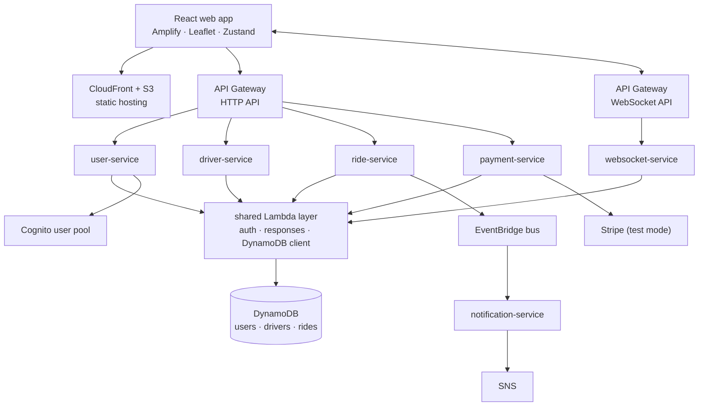

# Serverless Ride-Sharing Backend

**A ride-sharing backend built as six Lambda-backed services behind AWS managed infrastructure, with
the environment declared in Terraform.**

Ride hailing is the textbook always-on backend, which normally means paying for servers that sit idle
between requests. This is the same system built so that nothing runs between rides: HTTP API Gateway in
front of Lambda, DynamoDB on-demand for state, a separate WebSocket API for live location, and Cognito
for auth.

> **Status: architecture and service-layer study, not a deployed product.** The service handlers, the
> shared Lambda layer, the tests, and the CI workflow are written and readable. The Terraform stack is
> incomplete: it provisions the data and edge layer but does not yet declare the Lambda functions, the
> API routes, or the IAM roles, so the system does not currently deploy end to end. The exact gaps are
> listed under [Current limitations](#current-limitations). There is no live demo.

---

## Who this is for

Anyone reading the repository to see how a serverless backend is decomposed: where the service
boundaries fall, what goes in a shared layer, how a WebSocket API sits alongside a request/response API,
and what the infrastructure looks like as code rather than as console screenshots.

---

## Architecture



Every function writes to a CloudWatch log group with 7 day retention, omitted from the diagram because
it connects to everything.

### Services

| Service | Lines | Responsibility |
|---|---:|---|
| `user-service` | 188 | Registration, profile, token validation |
| `driver-service` | 292 | Driver registration and availability |
| `ride-service` | 358 | Ride matching and status transitions |
| `payment-service` | 367 | Fare calculation and Stripe charges (test mode) |
| `notification-service` | 425 | Event-driven email and SMS via SNS |
| `websocket-service` | 264 | Connection lifecycle and live location broadcast |

All six share `backend/shared/layers/common/utils.js`, which provides the response envelope, JWT
validation, and a DynamoDB DocumentClient configured with three retries and a 5 second timeout, plus SNS
and EventBridge clients.

---

## Engineering decisions

**HTTP API rather than REST API.** API Gateway's HTTP API is roughly 70% cheaper per million requests
than the REST API at AWS list pricing, and this workload needs none of the REST-only features (request
validation happens in the handlers with Joi, and there are no usage plans or API keys). This is a
pricing-model choice, not a measured saving on this project.

**On-demand DynamoDB, no provisioned capacity.** A portfolio-scale workload has no steady traffic to
provision for, and on-demand costs nothing when idle. Access patterns drove the GSIs rather than the
other way around.

**A separate WebSocket API instead of polling.** Live driver location is a push problem. Polling a REST
endpoint every few seconds would dominate the request count and therefore the bill.

**A shared Lambda layer instead of duplicating helpers.** Auth and the response envelope must behave
identically in all six services, and copies drift.

**EventBridge between ride and notification.** Notifications should not be on the critical path of a
ride status change. The ride service emits an event and returns.

**CloudWatch log retention set to 7 days.** Logs are the quiet cost line in serverless. Retention is set
deliberately rather than left at "never expire".

---

## Technology stack

**Backend** Node.js, AWS Lambda, DynamoDB, API Gateway v2 (HTTP and WebSocket), Cognito, EventBridge,
SNS, CloudWatch Logs, Stripe (test mode), Joi, jsonwebtoken

**Frontend** React 18, AWS Amplify, Leaflet, Zustand, Workbox

**Infrastructure** Terraform, S3, CloudFront

**CI** GitHub Actions with OIDC role assumption (no long-lived AWS keys)

**Testing** Jest with `aws-sdk-mock`, Playwright, boto3 for the cost monitor

---

## Repository layout

```
backend/
  services/<name>-service/handler.js   six Lambda handlers
  services/user-service/tests/         Jest unit + integration tests
  shared/layers/common/                shared Lambda layer
  shared/middleware/authMiddleware.js
  infrastructure/terraform/            main.tf, variables.tf, outputs.tf
  infrastructure/monitoring/           CloudWatch dashboard definition
  infrastructure/scripts/cost-monitor.py
frontend/web-app/                      React client
.github/workflows/backend-deploy.yml   test → infra → lambdas → integration → cost
```

---

## Local setup

```bash
git clone https://github.com/patsypppe/ridesharing-app.git
cd ridesharing-app
cp .env.example .env
```

Inspect the infrastructure without applying it. This needs Terraform and AWS credentials configured, and
it creates nothing:

```bash
cd backend/infrastructure/terraform
terraform init
terraform validate
terraform plan
```

Run the cost monitor against your own account (read-only, requires Cost Explorer permissions):

```bash
pip install boto3
python backend/infrastructure/scripts/cost-monitor.py
```

The frontend and the Node test suite are **not currently runnable from a clean clone**. See
[Current limitations](#current-limitations).

---

## Environment variables

Copy `.env.example` and fill it in. Nothing secret belongs in the repository.

| Variable | Used by | Notes |
|---|---|---|
| `USERS_TABLE`, `DRIVERS_TABLE`, `RIDES_TABLE` | all services | DynamoDB table names |
| `JWT_SECRET` | shared layer | token validation |
| `STRIPE_SECRET_KEY` | payment-service | Stripe **test** key |
| `SNS_TOPIC_ARN` | notification-service | |
| `EVENT_BUS_NAME` | ride-service | |
| `REACT_APP_AWS_REGION` | frontend | |
| `REACT_APP_USER_POOL_ID`, `REACT_APP_USER_POOL_CLIENT_ID` | frontend | Cognito |
| `REACT_APP_API_GATEWAY_URL`, `REACT_APP_WEBSOCKET_URL` | frontend | |

CI additionally expects the repository secret `AWS_ROLE_ARN`, an IAM role trusted for GitHub OIDC.

---

## Current limitations

These are real gaps, listed so nobody has to discover them by cloning.

- **Terraform does not declare the compute layer.** The stack provisions S3, CloudFront, three DynamoDB
  tables, Cognito, both API Gateway v2 APIs, an EventBridge bus, an SNS topic, and a CloudWatch log
  group. It declares **no `aws_lambda_function`, no API routes or integrations, and no IAM roles**, so
  the two APIs have no routes attached and the handlers are never deployed.
- **`outputs.tf` is empty.** The CI workflow reads `api_gateway_url`, `user_pool_id`, and
  `user_pool_client_id` from it, and gets nothing.
- **`backend/package.json` is missing**, so `npm ci` and `npm test` fail from a clean clone even though
  the Jest tests exist.
- **The CI matrix is wrong.** It deploys a `location-service` that has no code and omits
  `websocket-service`, which does.
- **The frontend does not build.** `src/index.js` and `public/index.html` are absent, and `App.js`
  imports seven components that do not exist. Only `RideBookingPage` is implemented.
- **The system has never been deployed.** There is no live URL, no Terraform state, and no CI run to
  point at. Any performance, uptime, or monthly-cost figure would be invented, so none is quoted here.

---

## Roadmap

In dependency order, since each unblocks the next:

1. Add `backend/package.json` so the existing tests can run.
2. Populate `outputs.tf`.
3. Add the Lambda functions, API routes and integrations, and IAM roles to Terraform.
4. Fix the CI service matrix.
5. Restore the frontend entry point and the missing pages.

---

## License

MIT. See [LICENSE](LICENSE).
